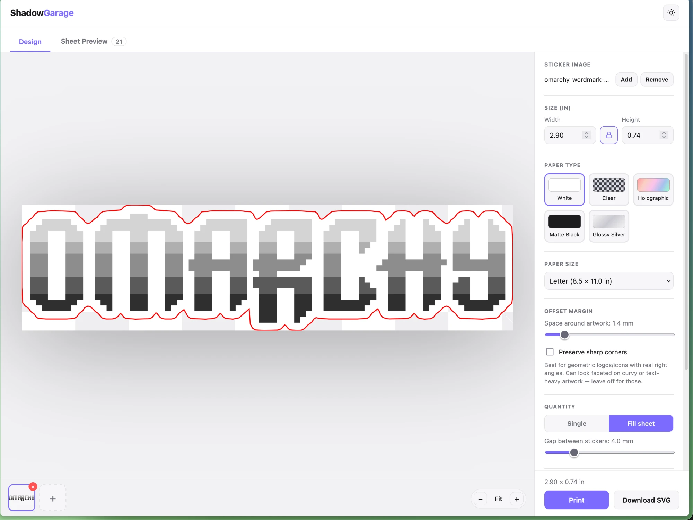
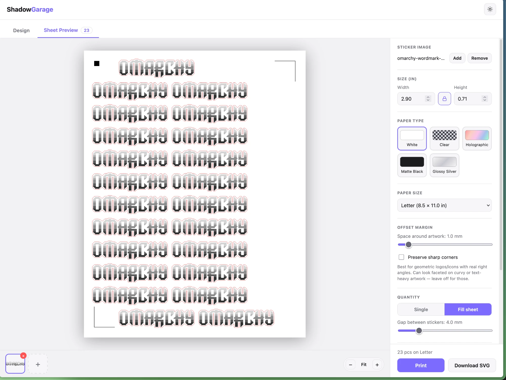

# Shadow Garage

**🔗 Live app: [https://spuder.github.io/shadow-garage/](https://spuder.github.io/shadow-garage/)**

A web app for turning a logo, wordmark, or image into a print-and-cut sticker file. It
auto-traces a die-cut outline around your artwork and exports a ready-to-cut SVG — with real
Silhouette-style registration marks baked in — that you can print directly from the browser or
send on to whatever actually drives your plotter.

## Why this exists

Getting stickers printed and cut on a Silhouette Cameo (or similar vinyl cutter) usually means
choosing between two bad options:

- **Silhouette Studio**, the official software, is paid — the print-and-cut workflow that
  actually matters is locked behind a Business/Designer Edition upgrade — and has a well-earned
  reputation for being buggy and unstable.
- **Inkscape + the [inkscape-silhouette](https://github.com/fablabnbg/inkscape-silhouette)
  extension** is free and open source, but notoriously fiddly to get working: Python environment
  issues, USB/driver quirks, and an extension UI with plenty of rough edges.

Shadow Garage doesn't try to replace either of those. It just handles the one part that's
genuinely annoying to get right — turning an arbitrary image into a correctly-sized,
correctly-registered cut file — entirely in the browser, with no install. The resulting SVG
(marks included) is then handed off to whichever cutting path you've already got working:
imported into Silhouette Studio, sent straight to the plotter with
[Plottie](https://github.com/mossblaser/plottie) (a command-line tool that cuts/plots an SVG on a
Silhouette machine directly — no Silhouette Studio or Inkscape required, and it auto-detects
registration marks), or any other script that talks to the cutter.

  
  

## What it does

- **Upload one or more images** (PNG, JPEG, or SVG) — drag-and-drop or multi-select, with a
  thumbnail strip to manage them.
- **Auto-traces a die-cut outline** around the artwork's alpha silhouette, with a margin/bleed
  you control. Disconnected pieces (separate letters in a wordmark, for example) get merged into
  one cuttable path; interior holes (the counter of an "O") are correctly left uncut, matching
  how real vinyl die-cuts are actually made. An optional "preserve sharp corners" mode keeps
  right angles crisp on geometric logos instead of rounding everything.
- **Resize by dragging a corner** directly on the canvas, or fine-tune exact Width/Height in the
  side panel with an aspect-ratio lock (or unlock it to deliberately stretch).
- **Pack multiple stickers onto a sheet** (Letter / A4 / A3) — one of each, or auto-filled to
  cover the page — with a live preview and per-sticker delete/resize right on the sheet.
- **Silhouette-style registration marks** — Standard (3-mark) or Four-corner — reverse-engineered
  from inkscape-silhouette's own mark generator (spec credited below), with sticker placement
  automatically kept clear of the marks so nothing overlaps or obscures them.
- **Print directly** to your system print dialog at true physical size, or **download the SVG**
  for use elsewhere.
- Paper type swatches (White / Clear / Holographic / Matte Black / Glossy Silver) and a
  dark/light theme.

## Registration marks

The mark geometry (a solid square top-left, L-shaped brackets top-right/bottom-left, 0.3mm
stroke, 10mm inset from the page edge, 20mm arms) is reverse-engineered from
[fablabnbg/inkscape-silhouette](https://github.com/fablabnbg/inkscape-silhouette)'s
`render_silhouette_regmarks.py` (GPL-2.0) — studied for the spec, not vendored. See
[`src/lib/regmarks.ts`](src/lib/regmarks.ts).

## License

MIT — see [LICENSE](LICENSE).
